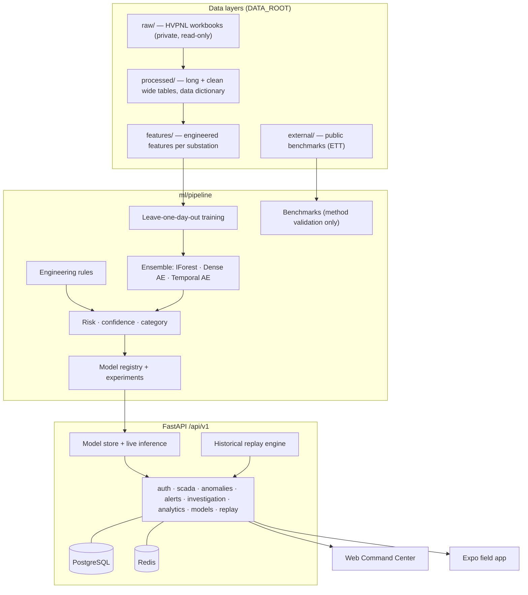
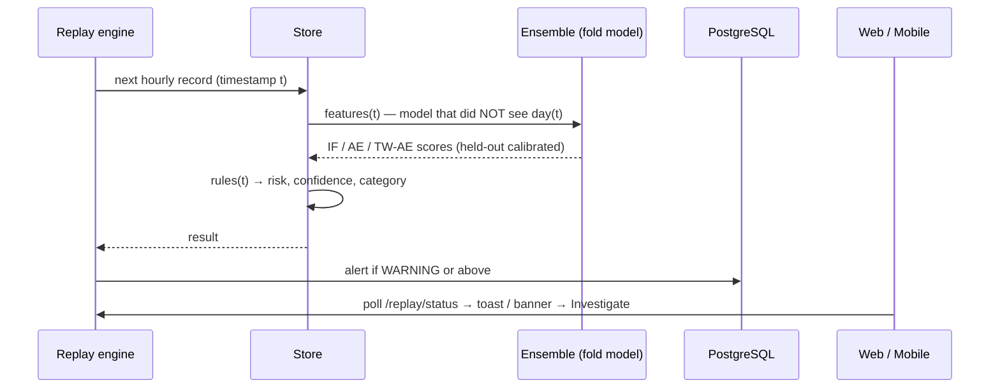

# GridIntel

**AI-Powered Grid Intelligence for Predictive Substation Monitoring**

GridIntel turns historical and (future) streaming SCADA data from electrical substations into anomaly detection, an operational risk indicator, equipment-level intelligence, early warnings, explainable investigations and fleet analytics. It is demonstrated on real daily log sheets from HVPNL Faridabad 220 kV / 66 kV substations, with **220 kV Sector-46** as the primary case study.

> **Research disclaimer.** This prototype is intended for research, monitoring and decision-support purposes. Risk scores and anomaly alerts are model-generated indicators and must not be treated as certified protection or fault-diagnosis outputs. It is not a protection system, does not control the grid, does not predict faults with certainty and does not replace SCADA/EMS. Risk categories are a *prototype AI risk classification*, not utility protection thresholds.

---

## Contents
[Links](#links) · [Overview](#overview) · [Architecture](#architecture) · [Features](#features) · [Dataset methodology](#dataset-methodology) · [ML methodology](#ml-methodology) · [Installation](#installation) · [Development](#development) · [Production deployment](#production-deployment) · [Environment variables](#environment-variables) · [API](#api) · [Mobile app](#mobile-app) · [Languages](#languages) · [Model training](#model-training) · [Evaluation](#evaluation) · [Security](#security) · [Limitations](#limitations)

## Links

| | URL | Status |
|---|---|---|
| GitHub | https://github.com/TanviSaraswat8/gridintel (branch `main`) | live |
| CI | https://github.com/TanviSaraswat8/gridintel/actions | runs on every push |
| Web (landing / command center) | `https://<service>.onrender.com/` · `/app` | not deployed yet (needs a Render account; see [docs/deployment.md](docs/deployment.md)) |
| API | `https://<service>.onrender.com/api/v1` · `/health` · `/ready` · `/docs` | not deployed yet |
| Mobile (browser build) | `https://<service>.onrender.com/mobile` | not deployed yet |

These rows get the real URLs once the service is live.

## Overview

| Layer | What it does |
|---|---|
| Ingestion | Parses HVPNL daily-log workbooks (merged 3-level headers, four time formats, status tokens inside numeric columns), preserving original parameter names |
| Feature store | Deviation, rate of change, rolling mean/min/max/std, bus-section and parallel-circuit mismatch, loading vs nameplate rating, winding-temperature-vs-load residual, circuit drop-outs, equipment state transitions |
| Anomaly engine | Isolation Forest + dense autoencoder + temporal-window autoencoder + engineering rules → anomaly score, operational risk (0–100), confidence (0–100), category NORMAL / WATCH / WARNING / HIGH RISK / CRITICAL |
| Validation | Leave-one-day-out on HVPNL records: every day is scored by models that never saw it |
| API | FastAPI `/api/v1`, JWT + roles, PostgreSQL (Alembic), Redis, structured logs, Prometheus `/metrics`, `/health`, `/ready` |
| Web | Landing page + Command Center: SCADA Live, Digital Substation, Investigation workspace, Fleet, Analytics, AI Model Lab, Data Explorer |
| Mobile | Expo / React Native field app on the same API (also served as a browser build at `/mobile`) |

**Data privacy.** The HVPNL Faridabad workbooks are private. They aren't in this repository (`.gitignore`), in the Docker image (CI checks for this) or in any uploaded bundle. The app runs in one of two clearly labelled modes:
- **LOCAL REAL-DATA MODE**: on your own machine, with the workbooks in `data/raw/`. Full replay, including verbatim Excel cell text in Data Explorer.
- **PUBLIC DEMO MODE**: on a hosted service. It uses only an admin-uploaded bundle of model artifacts and derived values. Verbatim cell text is stripped, raw file names are hidden, demo logins are off, and every endpoint requires sign-in.

**Data honesty rules (enforced in code and UI):** no fabricated measurements; sheets without readings show *NO SOURCE READINGS*; live ingestion shows *LIVE INGESTION NOT CONNECTED*; demonstrations use *HISTORICAL REPLAY* of the supplied records; no accuracy/precision/recall is reported where no labels exist.

## Architecture





Details: [docs/architecture.md](docs/architecture.md).

## Features

- **Command Center** — grid health index, active substations, alerts, high-risk events, model status, substation network (nodes coloured by AI risk, click to investigate), demo investigations, risk timeline.
- **SCADA Live** — modes LIVE (disabled, not connected) / HISTORICAL REPLAY / DEMO; voltage, load, current, temperature trends; breaker/circuit states; replay at 1×/2×/5×/10×.
- **Digital Substation** — single-line diagram generated from the sheet structure (buses, transformers with ratings, feeders, couplers), status colours, equipment drawer with values, signals, rules and recent history.
- **Investigation workspace** — alert timeline · interactive signal trace with baselines · AI panel answering *what happened / why flagged / how unusual / what to investigate*, contributing signals, evidence table of source measurements, engineer notes.
- **Fleet Intelligence** — all 24 sheets, voltage/load/temperature health, sort by risk / newest anomaly / temperature / loading.
- **Analytics** — date range, substation and parameter filters; trends, risk distribution, anomaly timeline, equipment loading vs rating, contributing-signal ranking, correlation matrix.
- **AI Model Lab** — model versions, configs, artifacts with SHA-256, inference latency, unsupervised validation, reviewed events, public benchmarks.
- **Data Explorer** — raw cell vs cleaned value, rolling statistics, anomaly score, paginated, CSV export (audit-logged).
- **Languages** — English, हिन्दी (Hindi), हरियाणवी (Haryanvi) and ਪੰਜਾਬੀ (Punjabi) across the landing page, command center and field app, including the AI investigation text (see [Languages](#languages)).
- Command palette (Ctrl/⌘ K), keyboard shortcuts (1–8 pages, Space play/pause, N next), toasts, skeletons, confirmation dialogs, responsive layouts.

## Languages

The switcher sits in the top bar, on the sign-in screen and in the landing-page header (field app: sign-in and Profile). The choice is remembered per browser.

- One table, `i18n/translations.py`, holds every string in four languages. English text is the lookup key, so pages are written in English and translated as they render.
- The API sends each explanation sentence with a template key and display-ready values (`"i18n": {"what": ["rule.R-V1.msg", {...}]}`), and the clients rebuild it in the viewer's language. Engineering rules, observed-signal sentences and the "why / expected / what to check" text are all covered.
- Source data stays as written: substation names, HVPNL parameter labels, units and numbers are not translated.
- After editing the table, run `python scripts/build_i18n.py` to regenerate `frontend/assets/js/i18n-strings.js` and `mobile/src/strings.js`. The test suite fails if they are stale or if any template is missing a placeholder.
- The Haryanvi and Punjabi wording should be reviewed by a native-speaking engineer before field use.

## Dataset methodology

Two dataset roles, never mixed (registry: [`data/sources/dataset_registry.yaml`](data/sources/dataset_registry.yaml)):

| Dataset | Role | Used for |
|---|---|---|
| **Dataset A — HVPNL Faridabad daily logs** (02, 10, 27 Feb 2026) | real-world validation data (private) | per-substation models with leave-one-day-out out-of-sample scoring |
| **ETTh1 — Electricity Transformer Temperature** (CC BY-ND 4.0) | public benchmark | validating the thermal-residual idea and drift behaviour; never used to fit HVPNL models |

Of 24 worksheets, **6 contain readings** (220 Sec-46, 220 A4, 220 Palla [10 Feb only], 66 Sector 64, 66KV USA, 66 Escort I); the other 18 are blank templates and are shown as *Data unavailable in supplied records*. Public grid datasets do not share HVPNL's parameter schema, so a model trained on them cannot score HVPNL records directly — they are used for method validation only. See [docs/dataset.md](docs/dataset.md) and [docs/research-methodology.md](docs/research-methodology.md).

## ML methodology

1. Causal preprocessing (forward-fill ≤ 2 h within a day, otherwise training-days median; `-`/blank never become zero).
2. Features documented in [docs/features.md](docs/features.md).
3. Per substation, per held-out day: fit Isolation Forest (300 trees), dense autoencoder and temporal-window autoencoder on the other days; calibrate each score on inner held-out days (split-conformal style) to 0–100.
4. Anomaly = 0.45·IF + 0.30·AE + 0.25·TW-AE. Risk = 0.7·max(anomaly, rules) + 0.3·mean(anomaly, rules). Confidence = agreement across models and rules + data coverage + training size.
5. Explanations: occlusion attribution on the Isolation Forest + fired engineering rules → *contributing signals*, never causes.
6. LSTM autoencoder and supervised XGBoost/LightGBM are registered as **not trained**, with reasons (sequence length; no genuine labels).

Details: [docs/model.md](docs/model.md).

## Installation

Requirements: Python 3.11–3.13, Node 20+ (mobile), optional Docker.

```bash
git clone <repo> gridintel && cd gridintel
python -m venv .venv && source .venv/bin/activate        # Windows: .venv\Scripts\activate
pip install -r requirements-dev.txt
cp .env.example .env
# place the private HVPNL workbooks in data/raw/  (see data/README.md)
python scripts/build_pipeline.py                          # dataset → features → models → reports (~2 min)
cd backend && python -m alembic upgrade head && uvicorn app.main:app --reload --port 8000
```
Open http://localhost:8000 (landing) → **Launch Command Center** (http://localhost:8000/app). Demo users: `operator`, `engineer`, `viewer` / `hvpnl2026` (disable with `DEMO_USERS_ENABLED=false`).

Windows shortcuts: `setup_windows.bat`, `run_backend.bat`, `run_mobile.bat`, `run_tests.bat`.

## Development

```bash
ruff check backend ml tests scripts          # lint
pytest -q --cov=backend/app --cov=ml/pipeline # 35 tests on a synthetic fixture workbook (no private data needed)
python scripts/fetch_public_data.py && python scripts/run_benchmarks.py   # public benchmarks
docker compose up --build                     # API + PostgreSQL + Redis
```
Repository layout: `backend/` (FastAPI app, Alembic migrations) · `ml/pipeline/` (ingestion, features, rules, ensemble, evaluation, benchmarks) · `frontend/` (static web app) · `mobile/` (Expo) · `data/` (layers + registry) · `models/` (registry; artifacts not committed) · `scripts/` · `docs/` · `tests/`.

## Production deployment

| Component | Target | Config |
|---|---|---|
| API | Render (Docker) or any container host | `Dockerfile`, `render.yaml`, `docker-compose.prod.yml` |
| Database | Managed PostgreSQL | `DATABASE_URL` (migrations run on start) |
| Cache | In-memory (single instance); Redis optional | `REDIS_URL` (unset on Render) |
| Web | Served by the API (same origin); Vercel optional | `frontend/vercel.json`, `API_URL` env → `config.js` |
| Mobile | Expo | `EXPO_PUBLIC_API_URL` or set on sign-in |
| CI/CD | GitHub Actions | `.github/workflows/ci.yml`, `deploy.yml` |

Step-by-step: [docs/deployment.md](docs/deployment.md).

**Private data in a stateless deployment.** Neither the repository nor the container image contains HVPNL data or models. One Render web service serves the API, the web command center (`/`, `/app`) and the mobile web build (`/mobile`). After the first deploy it starts in *AWAITING DATA* mode. An ADMIN signs in at `/app` and uploads the bundle on the **Awaiting data** screen, or uses the CLI:

```bash
python scripts/package_artifacts.py --upload https://<service>.onrender.com --username <ADMIN_USERNAME>
```

The bundle is validated (allowed paths only, no links, size caps), stored in PostgreSQL and restored on every start, so free-tier instances that sleep and lose their disk come back without retraining. Training on the server is off (`TRAIN_ON_START=false`) because it needs ~1 GB RAM; serving needs ~220 MB.

## Environment variables

| Variable | Purpose | Default |
|---|---|---|
| `APP_ENV` | development / staging / production | development |
| `API_URL` | public API URL (web `config.js`) | same origin |
| `DATABASE_URL` | PostgreSQL URL (`postgres://` accepted) | local SQLite |
| `REDIS_URL` | Redis URL | in-memory |
| `JWT_SECRET` | ≥ 32 chars, **required in production** | ephemeral in dev |
| `JWT_EXPIRE_MINUTES` | token lifetime | 480 |
| `CORS_ORIGINS` | comma-separated; `*` refused in production | own URL on Render (`RENDER_EXTERNAL_URL`), `*` in dev |
| `DATA_MODE` | `local` (real workbooks on this machine) / `public` (uploaded bundle only) | `local` if `data/raw/*.xlsx` exist |
| `DATA_ROOT` / `MODEL_PATH` / `REPORTS_DIR` | data layers, model registry, reports | `./data`, `./models`, `./reports` |
| `ADMIN_USERNAME` / `ADMIN_PASSWORD` | bootstrap admin (hashed on first start) | unset |
| `DEMO_USERS_ENABLED` | demo operator/engineer/viewer | true |
| `RATE_LIMIT_PER_MINUTE` / `LOGIN_RATE_LIMIT_PER_MINUTE` | rate limits per IP | 600 / 20 |
| `ALERT_MIN_RISK`, `REPLAY_BASE_INTERVAL_SEC`, `PRIMARY_SUBSTATION` | replay/alerting | 56, 3.0, 220-sec-46 |

## API

OpenAPI at `/docs`. Main routes (all under `/api/v1`, bearer token unless noted): `auth/login`, `auth/me`, `auth/audit` (ADMIN), `public/stats` (public), `command-center`, `substations`, `substations/{id}`, `substations/{id}/topology`, `scada/latest|record|history`, `alerts` (+ `/{id}/acknowledge`), `anomalies`, `investigations`, `investigations/demo`, `investigations/notes` (ENGINEER), `analytics`, `fleet`, `models`, `parameters`, `explorer`, `explorer/export.csv`, `replay/status|start|pause|stop|next|speed|seek` (OPERATOR). System: `/health`, `/ready`, `/metrics`. Reference: [docs/api.md](docs/api.md).

## Mobile app

`mobile/` — Expo SDK 57. Splash → sign-in (server URL editable) → bottom navigation **HOME · GRID · ALERTS · ANALYTICS**, plus Substation detail, SCADA, Investigation and Profile. In-app alert banner for new replay alerts.
```bash
cd mobile && npm install && npx expo start --lan     # scan with Expo Go (SDK 57)
```
No-install fallback: open `http://<api-host>/mobile` on the phone.

## Model training

`python scripts/build_pipeline.py` reproduces everything deterministically (seed 42): processed data, feature store, `models/ensemble/<substation>/{fold-<day>,full}.joblib`, `models/registry.json` (versions, SHA-256, fingerprints, configs), `models/feature_schema.json`, `experiments/<run_id>.json` (dataset hashes, features, hyper-parameters, seed, metrics, environment) and `reports/evaluation.{md,json}`.

## Evaluation

Unsupervised evaluation only (no fault labels): out-of-sample risk distributions, seed stability, out-of-sample vs in-sample rank agreement, component agreement, reviewed real events, operator-state reference, public benchmark. Highlights from the current run:

- **02 Feb 2026 10:00, 220 kV Sector-46** — 11 kV T-I voltage logged 0 kV: **HIGH RISK** out-of-sample (rule R-V1 + models).
- **10 Feb 2026 08:00, 220 kV Sector-46** — T-2 11 kV incomer and several feeders to 0 A while T-4 loading rose: **HIGH RISK**, driven by rule R-L1; the ML models alone scored it low on the unseen day — evidence for the hybrid design.
- **Same hour, 66 kV USA** — also HIGH RISK out-of-sample (incomer/feeder drop-out). USA is fed from the Palla and Sector-46 lines; the coincidence is worth checking against the shift log but the data cannot establish a cause.
- **27 Feb 2026, 220 kV A4** — all four transformers run ~15 °C hotter than the 2 and 10 Feb load→temperature relationship predicts (T-1 oil 30 → 37 → 52 °C across the three days). Reported as a day-long WATCH-level offset (rule R-T3), because a station-wide shift across independent transformers is consistent with a warmer day and ambient temperature is not logged; only hour-level excursions beyond that offset escalate.
- Out-of-sample share of WARNING-or-above hours: Sector-46 4 %, 66KV USA 4 %, Sector 64 4 %, A4 11 %, Palla 8 % (single day, in-sample), Escort I 0 %.
- ETTh1: a static load→temperature fit does not generalise across seasons (test R² < 0), so the thermal residual is a contributing signal only.

### Data-quality findings (unit plausibility)
Merged log-sheet headers can mislabel a column. `ml/pipeline/plausibility.py` checks every header-inferred unit against physics before any rule or display uses it ([report](reports/data_quality.md) is generated locally):
- **66 Sector 64** — six columns under a merged *LOAD IN MVA* header are currents in amps: √3 × 11 kV × 410 A = 7.81 MVA and √3 × 66 kV × 68.3 A = 7.81 MVA, both matching the 7.81 MVA logged for T-1 (likewise T-2, T-3). Re-classified as currents. Before this check, a rule reported "794 % of rating".
- **66 Escort I** — the column headed *66 KV Bus I* holds values of 47–138 that follow the load curve; it cannot be a 66 kV bus voltage and is marked *unverified* (kept in the data, excluded from voltage rules and cards).
- Auxiliary 240 V AC and DC battery columns are separated from power-bus voltages.
No value is altered — only the label used by rules and displays.
- ETTh1: a static load→temperature fit does not generalise across seasons (test R² < 0), so the thermal residual is a contributing signal only.

Full report: `reports/evaluation.md` (generated; not committed because it summarises private data).

## Security

JWT (HS256, expiry) with ADMIN / ENGINEER / OPERATOR / VIEWER roles; PBKDF2-SHA256 password hashes; rate limiting (Redis-backed when available); Pydantic validation; CORS allow-list; security headers (CSP, frame-deny, nosniff, HSTS in production); audit log (logins, replay control, exports, notes); request IDs; secrets only from the environment; private data excluded from Git and Docker build context. See [SECURITY.md](SECURITY.md).

## Limitations

- Three non-consecutive days of hourly manual logs; ≤ 72 records per substation; 18 of 24 sheets blank. Models describe short-term unusualness, not seasonal behaviour.
- No fault labels: risk is a calibrated relative indicator, not a fault probability; thresholds are prototype values.
- Units are inferred from sheet headers and checked for physical plausibility; one Escort I column could not be verified and is excluded from engineering rules. Nameplate ratings are parsed from header text.
- Ambient temperature is not in the logs, so the thermal rules cannot separate a warmer day from a transformer effect (hence R-T3 is WATCH-level only).
- Rolling/rate features reset each day (days are not consecutive).
- Replay only — live SCADA ingestion is not connected. Single-process replay engine (state mirrored to Redis, not shared across workers).
- LSTM autoencoder and supervised models not trained (insufficient sequences; no labels).

## Future work
Continuous historian ingestion; seasonal/ambient-aware thermal model (IEC 60076-7 style hot-spot); labelled event records for honest precision/recall; LSTM-AE on long sequences; SHAP; multi-worker replay via Redis streams; MLflow tracking server.

## License
[MIT](LICENSE) for the code. The HVPNL records are private and not covered by this license; ETT is CC BY-ND 4.0 (downloaded, not redistributed).
